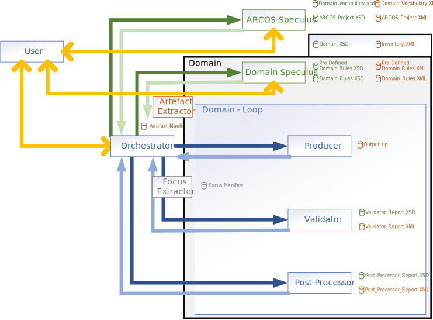

# ARCOS Architecture

The following diagram illustrates the high-level architecture of the ARCOS system. It shows the interaction between the **Maestro** coordinator and the various agents: **Speculus**, **Producer**, **Validator**, and **Post-Processor**.

All communication between these components is handled via standardized XML messages, which are validated against the official ARCOS schemas.

